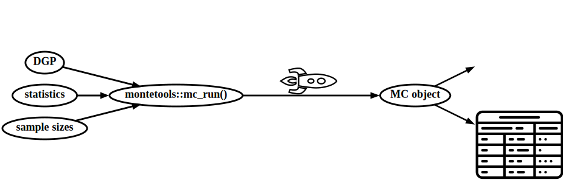
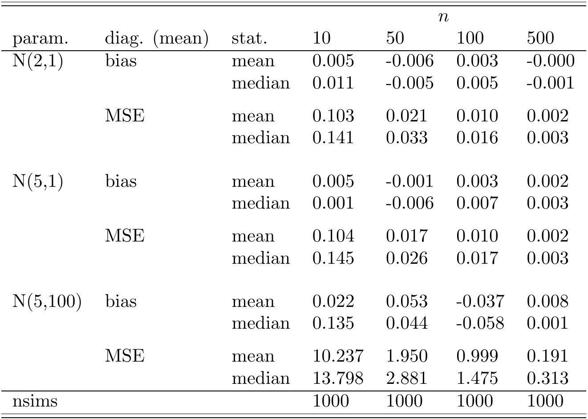
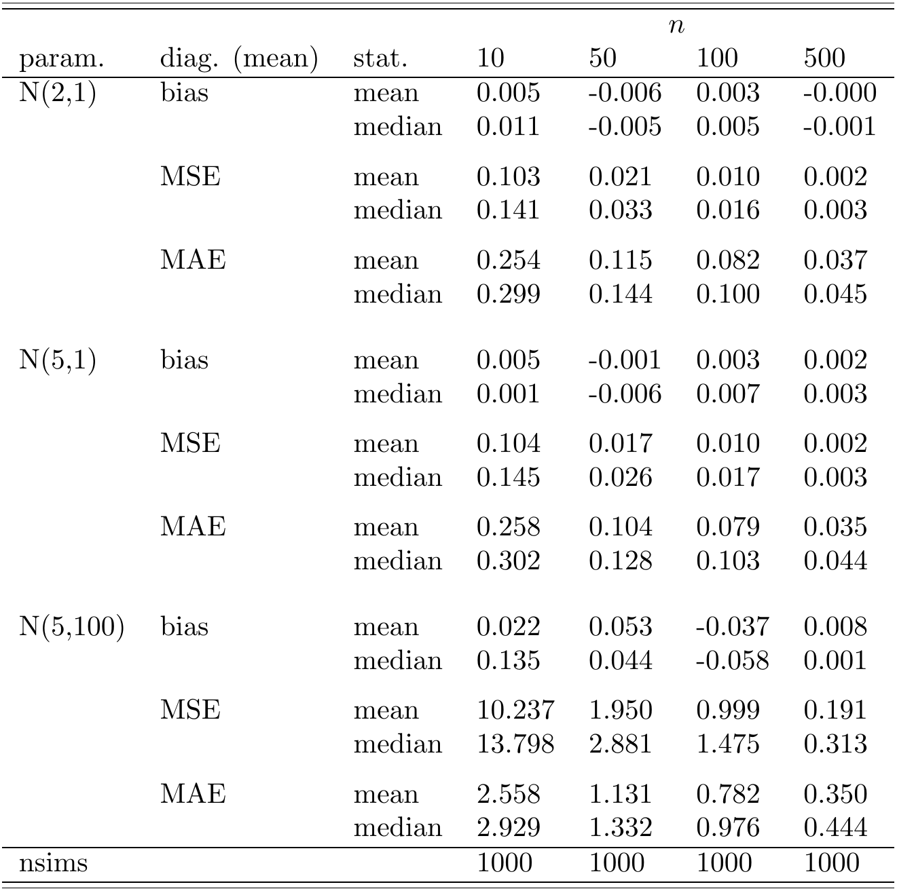
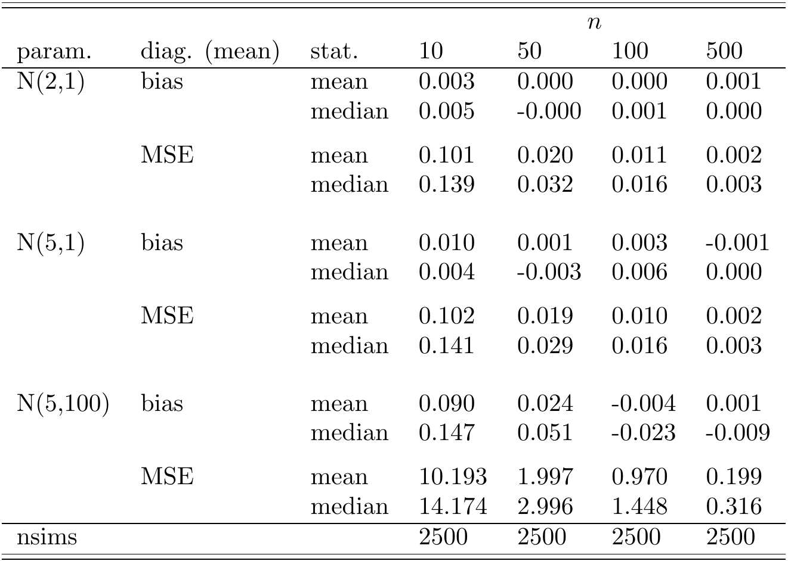

# montetools

R package to run Monte Carlo (MC) simulations, display results, reproduce them, and everything in-between.

# Details

This package is especially beneficial for MCs that take considerable amounts of time (e.g., hours, days).

Current state of development: alpha.
- montetools is currently in alpha because (1) the interface should not be considered stable (e.g., the argument names could change) and (2) there are bugs lurking and I need testing from workflows other than my own to lure them out so I can fix them. After feedback and testing from others, montetools will move towards a more stable state.

# Features

Please make feature requests! Here is a list of current features:

1. Run simulations in parallel.
    * Thanks to standing on the shoulders of the [futureverse](https://www.futureverse.org/), your code will run on Windows, macOS, and Linux; on your computer or in the cloud; on a laptop or on a high-performance compute cluster.
1. Maintain reproducibility.
    * Your results will be numerically reproducible, whether you run your code in parallel or sequentially, and whether you extend or merge results (see below).
1. Quickly check whether results can likely be numerically reproduced.
    * Some code changes are meant for organization, or simplification, and it is helpful to confirm that such changes do not affect the results.
    * After you upgrade a dependency (e.g., other R package), it is helpful to know that your results are exactly unchanged. montetools can figure this out with moderate confidence by just checking that the first, e.g., 10 simulations are equivalent.
    * montetools logs the versions of packages, so if your results differ you can check the differences of package versions to get an idea of what might have caused a difference in results.
1. Handle errors without stopping remaining simulations.
    * Errors can occur in some statistics, e.g., due to rank deficiency. montetools can be configured to log the error and continue.
    * You can also quickly recover the realized simulation that caused an error, which can be helpful when debugging.
1. Show partial results in-progress.
    * There is no need to wait for the simulations to end to check the current results.
1. Optionally maintain backups of in-progress simulations.
    * In the case of a power outage, you do not want to lose potentially days of simulations. You can restart the simulations from the backup.
    * Similarly, it can happen that the system runs out of RAM for large sample sizes. In this situation, all previous results will be backed up.
1. Extend an existing MC, maintaining reproducibility.
    * Suppose you initially did 500 simulations but want to get to 1000. You can add on to the number of simulations, and the combined results will still be numerically reproducible, and will be equivalent to if you had run 1000 to begin with.
1. Merge MC simulations.
    * You can run simulations of part of an MC on one computer, and simulations of a different part on a different computer, and merge.
1. Output results to a LaTeX table.
    * It is important that results be publication ready, so no manual tweaking is needed. This way, if you make improvements to the code, everything in your paper adapts seamlessly.
1. Archive of past results, including corresponding Git info.
    * With the archive feature montetools automatically stores past MC runs, along with the corresponding state of code (e.g., the Git hash and Git diff), so you can answer questions like "I remember a month ago, one of the MC runs I did ended up with a negative bias. Which run was that and what change in the code caused that?"
1. Enforce separation of parameters and statistics, and make explicit what the statistic "knows".
    * You explain to montetools what the statistic is allowed to see. e.g., it can see the functional form of the specification but not the coefficients.
1. Analyzing the results is a separate step.
    * Suppose referee number 2 wants to see the L1 distance as a measure of distance from your estimator to the parameter instead of the L2 distance. You do not need to rerun your simulations.
1. Adding an additional parameter, or an additional sample size, does not change existing results.
    * The results of one chunk (i.e., combination of sample size and data generating process parameter) are invariant to the other sample sizes and parameters included in the table. Thus, numerical reproducibility is preserved. This way, you do not need to rerun all simulations from scratch for them to be numerically reproducible.
1.  * Extensible hook system. montetools was created with extensibility in mind. In fact, features such as in-progress results, backups, and extending and reproducing MCs were all implemented using the hook mechanism. That is, a user could have written these features without modifying the core code of montetools.

# Installation

montetools will eventually be on CRAN after some testing and fixes, but until then you can install the package from this GitHub repository. First, make sure you have the "remotes" package installed and then run the following:

    remotes::install_github("scottkosty/montetools", upgrade = FALSE)

# Tutorial example

Suppose we want to estimate the population mean from a sample. And suppose we assume the population has a symmetric distribution, so the mean equals the median. Two candidates to estimate the population mean are thus (1) the sample mean and (2) the sample median.

Here we will walk through an example of how to use montetools. We first build the main components of an MC, which we will pass as arguments to `mc_run()`. We will call the object `<arg>_` (note the underscore) that corresponds to argument `<arg>` of `mc_run()`. The commands are introduced one-by-one with explanations, but it is easiest to just read the explanations and then copy/paste the big code chunk at the end ("Putting everything together").

## `dgp_params`
The data generating process parameters (DGPPs) are the parameters that will be passed to the data generating process (DGP) (more on the DGP below). These parameters will be hidden from the statistic. These parameters, or parameterizations of them, are usually on the rows in an MC table.

In our example, let's consider simulating from a normal distribution with varying means and standard deviations. It would be sufficient to just vary the standard deviations and keep the mean fixed, but we use this more complex setup to show how DGPPs are often of length greater than 1, and how we do not want the statistics to see the DGPPs (e.g., the population means).

    # In practice, we would not vary the mean for this particular example,
    # but it helps us get a feeling for how non-trivial DGPPs work.
    dgp_params_ <- list(c(mean = 2, sd = 1), c(mean = 5, sd = 1), c(mean = 5, sd = 10))

## `nvec`

The vector of sample sizes. These are often the columns in an MC table.

    nvec_ <- c(10, 50, 100, 500)

## `dgp`

A function that inputs two arguments, 'dgp_param' (an element of 'dgp_params'); and 'n', the sample size (an element of 'nvec'). Our `dgp()` must return one simulated data frame.

    dgp_ <- function(dgp_param, n) {
      rnorm(n = n, mean = dgp_param[["mean"]], sd = dgp_param[["sd"]])
    }

## `dgpp_to_poi`

A function that takes as input one `dgp_param` and outputs the parameter of interest (POI). For estimation, the POI is what `statistic()` is estimating. For example, squared error is often useful to calculate, and when aggregated using the mean will be the simulated mean squared error (MSE). The return is a list of length 2, where the first element is the numeric POI and the second element is a character label for the POI.

    dgpp_to_poi_ <- function(dgp_param) {
      # The first element in the list below is the actual numeric POI,
      # i.e., the parameter that the diagnostic will use to compare to
      # the estimator to calculate the bias, MSE, etc.
      # The second element is not used for calculation; it is a character
      # string used for printing.
      ret_l <- list(
                    poi = dgp_param[["mean"]],
                    # the label is used for referring to the parameter in progress
                    # messages and in the final output table, and should be unique.
                    # Will output N(<mean>, <sd>^2)
                    label = paste0("N(", dgp_param[["mean"]], ",", dgp_param[["sd"]]^2, ")")
               )
      return(ret_l)
    }

## `stat_knowledge`

A vector of names in a DGPP that the statistic will see. For example, we might allow the statistic to see the standard deviation, but not the mean. Or in parametric regression, the statistic can see the functional form, but not the coefficients.

    # do not allow the estimators to see the mean or the sd of the population.
    stat_knowledge_ <- NULL

## `statistics`

The list of statistics that will process the simulated data sets. In our case, we're doing estimation so the statistics are estimators.

    statistics_ <- function(dataf) {
      # since our dgp() returns a vector, the "dataf" input here is
      # also a vector. In most interesting examples, dgp() will return
      # a data frame, e.g., with columns x and y.

      # a 2x1 matrix. Each row is a different statistic.
      # The row names are the names of the statistics.
      ret_mat <- rbind(
                       mean = mean(dataf),
                       median = median(dataf)
                 )
    }

## `nsims`

The number of simulations. For each combination of DGPP and sample size, this is the number of simulations that will be run.

    # when first setting things up, start with a small 'nsims' (e.g., 3)
    # to make sure there is no error. Then increase.
    nsims_ <- 1000

## `diagnostics`

The list of diagnostics. Since we're doing estimation, a diagnostic compares the estimator to the POI.

    # we use two built-in diagnostics to report the bias and MSE.
    diagnostics_ <- list(diag_est_bias, diag_est_sq_error)

## `parallel`

Set to TRUE for the simulations to be run in parallel, or FALSE for sequential. Or (recommended) leave as NA so that you can control things at a finer detail by calling `future:::plan()` before running the simulations.

    # Setting to TRUE doesn't make a difference for this example because
    # dgp() and statistics() are very fast.
    parallel_ <- FALSE

<!-- (todo: where to put this?) The number of columns is usually `length(nvec)`. The number of rows is usually `length(dgp_params)` times the number of statistics returned by `statistics()`.-->

## Putting everything together

Now we put everything together and finally call `mc_run()`.

    library("montetools")

    dgp_params_ <- list(c(mean = 2, sd = 1), c(mean = 5, sd = 1), c(mean = 5, sd = 10))
    nvec_ <- c(10, 50, 100, 500)
    dgp_ <- function(dgp_param, n) {
      rnorm(n = n, mean = dgp_param[["mean"]], sd = dgp_param[["sd"]])
    }
    dgpp_to_poi_ <- function(dgp_param) {
      ret_l <- list(
                    poi = dgp_param[["mean"]],
                    # Will output "N(<mean>, <sd>^2)".
                    label = paste0("N(", dgp_param[["mean"]], ",", dgp_param[["sd"]]^2, ")")
               )
      return(ret_l)
    }
    stat_knowledge_ <- NULL
    statistics_ <- function(dataf) {
      ret_mat <- rbind(
                       mean = mean(dataf),
                       median = median(dataf)
                 )
    }
    nsims_ <- 1000
    diagnostics_ <- list(diag_est_bias, diag_est_sq_error)
    parallel_ <- FALSE

    # Now we run the actual simulations.
    # It's important to *assign* the result of mc_run(), or the results
    # will be lost.
    mc <- mc_run(dgp_params = dgp_params_, nvec = nvec_, dgp = dgp_,
                 dgpp_to_poi = dgpp_to_poi_, stat_knowledge = stat_knowledge_,
                 statistics = statistics_, nsims = nsims_,
                 diagnostics = diagnostics_, parallel = parallel_)

## What to do after the run?

The first thing we should do is to save the `mc` object we created as an Rds file.

    # The resulting file is 740K, and it has the observed values of
    # statistics() for every simulation.
    # You can use the "compress = 'xz'" argument to get a file size of 308K,
    # but when you read in the file with "readRDS()" it will be slower.
    saveRDS(mc, file = "mc.Rds")

We can output the results of our MC to a LaTeX table as follows:

    mc_table(mc, output_file = "table.tex")

After compilation, this results in the following PDF file:

## Adding diagnostic without rerunning

Referee #1 asks for the results of the mean absolute error (MAE), in addition to what we previously calculated, the MSE. We can address this without rerunning the simulations. The `mc` object has all realized values of `statistics()` so we just need to rerun the diagnostic part, which is very fast.

<!-- also, we mant want to remove the bias diag. The sample mean and median are both unbiased. We might want to have that diagnostic for the in-progress results just to raise a red flag if something is wrong. Finally, it gives us an idea of whether the nsims is high enough-->

    # we now include diag_est_abs_error in addition to the others
    diagnostics_ <- list(diag_est_bias, diag_est_sq_error, diag_est_abs_error)

    mcdiags <- mc_diags(mc, diagnostics = diagnostics_)
    mc_table(mcdiags, output_file = "table-additional-diag.tex")

## Extending results

<!-- TODO: different way to motivate extending: Suppose a referee is wondering whether the plim of BLAH is equal to the plim of BLAH. So we extend the sims to 2500.... Maybe do this when we can do tests between the plims, which is not implemented yet.-->

Referee #2 would like for the MC to have a total of 2500 simulations. Does this mean we have to rerun the 1000 simulations we already did? No, we can start from where we left off, and just run the additional 1500.

    # this will run 1500 additional simulations, and append them to the 1000 simulations
    # that are already inside 'mc'.
    mc <- mc_extend(mc, nsims_additional = 1500)
    mc_table(mc, output_file = "table-extended.tex")

<!-- TODO: need a way to refer to table values like knitr-->

## Reproducing results

It is helpful to be able to reproduce your results after upgrading other R packages, or a new version of R, or upgrades of other dependencies (e.g., C++ solver libraries that are called from `statistics()`).

<!-- Similarly, you can send your mc.Rds file to coauthors.-->

## Slow but sure

You can check whether every one of your simulations (and thus aggregate results) are exactly reproducible. This is slow because all simulations must be run again.

    # Will give an error if the reproduction fails (i.e., if any observed value of the estimator
    # is different for any simulation).
    # If the reproduce succeeds, the results are equivalent, but the 'mc'
    object has other information besides results, such as how much time it
    took the sims to run, and the package versions used, which could be different.
    mc_reproduced <- mc_reproduce(mc)

## Quick and usually good enough

A much quicker approach is to check that the first $k$ (e.g., 10) realizations of the statistics are exactly the same, which would suggest that the rest would also likely be the same.

    # If any simulation results in a different observed statistic, mc_reproduce()
    # will give an error.
    mc_reproduced10 <- mc_reproduce(mc, nsims = 10)

<!--
## Add a statistic without rerunning existing

I guess easiest is to just run with new statistic() and then merge results?
e.g., mode.
-->

<!---
# Debugging

(maybe put under debugging?)

Normally we do not call `statistic()` or `dgp()` directly. However, it can be helpful when constructing the initial arguments to `mc_run()` or when debugging.

    dgp_one <- dgp()
    stat_one <- statistic(dgp_param = dgp_one, )
-->

<!--
# How montetools works

One simulation result comes from the following:

1. Calculate...
One simulation

# Goals

1. Reproducibility. montetools cannot *guarantee* that your results will be reproducible in 10 years. But it can help!
-->

<!---
TODO: show screenshots of live results?
-->

<!---

# FAQ

## Do I need to use `set.seed()` to have numerically reproducible results?

You do not need to use `set.seed()`. The state of R's random number generator (RNG) is stored automatically by `mc_run()` and kept in the returned `MC` object, so that the RNG state can be restored when reproducing. You may *choose* to use `set.seed()`, but note also that the RNG state is not just the seed, but also the *kind* (as returned by `RNGkind()`). For example, the kind can change in a future R version. By archiving both the state and the kind in the returned MC object, the results should be reproducible in future R versions.
-->
